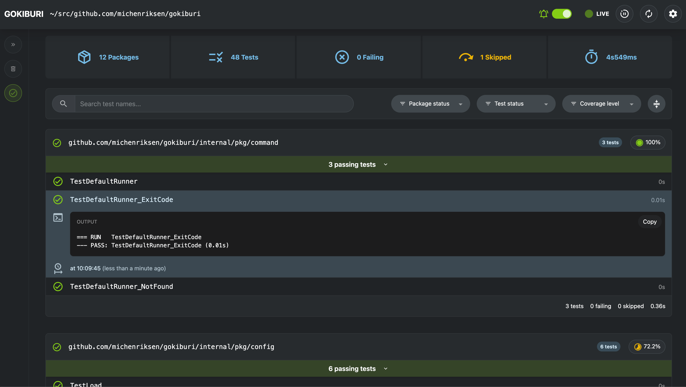
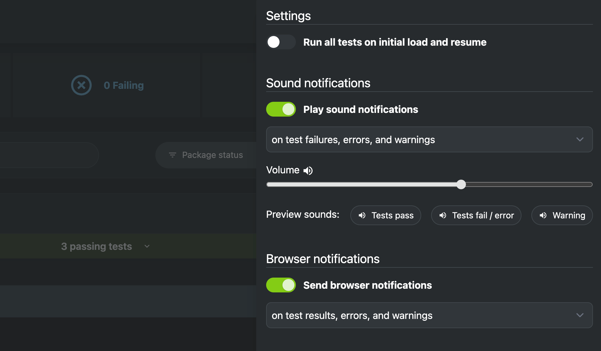
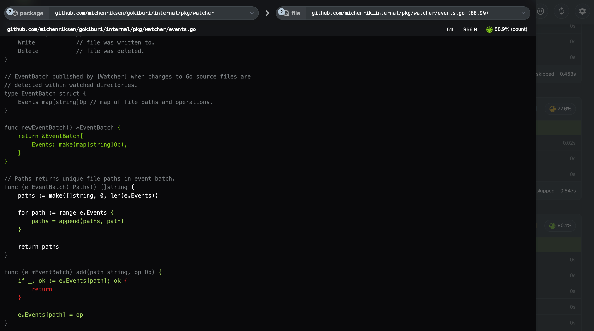

# Gokiburi: Automatic Test Runs for Go Projects

<div align="right">
    <a href="LICENSE.md"></a>
    <a href="https://goreportcard.com/report/github.com/michenriksen/gokiburi"></a>
    <a href="https://github.com/michenriksen/gokiburi/actions/workflows/build.yml"></a>
    <a href="https://github.com/michenriksen/gokiburi/actions/workflows/build-fe.yml"></a>
    
    <a href="https://github.com/michenriksen/gokiburi/releases"></a>
</div>

<br />
<br />
<br />
<div align="center">
    <picture>
    <source media="(prefers-color-scheme: dark)" srcset=".github/images/gokiburi_dark.png">
    <source media="(prefers-color-scheme: light)" srcset=".github/images/gokiburi_light.png">
    
    </picture>
</div>
<br />
<br />
<br />

Gokiburi is a powerful and user-friendly testing tool designed to enhance the developer experience in Go projects. It automatically runs tests in real-time by monitoring file changes, ensuring that your code remains robust and reliable throughout the development process. With Gokiburi, you can focus on writing code while it takes care of running tests and keeping you informed about your project's health.

## Highlights

- **Real-time monitoring**: Gokiburi keeps an eye on your Go project files and automatically triggers tests for the package where the file belongs as soon as a change is detected.
- **Sleek web UI**: Easily monitor and sift through test results using Gokiburi's intuitive web interface. Gain insights into your project's code coverage and quickly identify areas that need improvement.
- **Configurable notifications**: Stay informed about your project's health with customizable browser and sound notifications. Gokiburi will promptly notify you if something isn’t right, allowing you to fix the issue faster and more efficiently.

## Usage

> **Note**
> Gokiburi is currently a **work in progress** and should be regarded as beta software. Although I've been using it personally without any major problems, it may still contain bugs and quirks. If you encounter any issues or odd behavior, please don't hesitate to [create a new issue](https://github.com/michenriksen/gokiburi/issues/new).

Begin using Gokiburi with these steps:

1. Head to your Go project's root directory in a terminal.
2. Launch Gokiburi by entering the `gokiburi` command:

```shell
~/src/github.com/example/project $ gokiburi
```

Gokiburi will keep an eye on directories, monitoring for any changes in `.go` source files. When a modification or new file is detected, Gokiburi automatically runs tests for the package specified in the affected file.

You can, of course, use Gokiburi as a basic test runner and monitor the results on your terminal. However, its true potential shines when utilizing the web UI, which is accessible by default at [http://localhost:9393/].

The web UI offers a comprehensive view of all test results, complete with search and filter capabilities. This allows you to focus on the specific results you're interested in:



By clicking the gear icon button, you can access Gokiburi's web UI settings. Here, among other options, you can activate sound and browser notifications. This way, you'll be instantly alerted when something goes wrong, even when you're busy in your editor:



Gokiburi runs tests with code coverage by default. When you click the coverage button for a package, it opens the coverage report view. This helps you effortlessly pinpoint parts of your code with robust coverage, as well as areas that could use improvement:



## Installation

**It’s recommended to install the most recent pre-compiled binary release for your operating system and architecture from the [releases page](https://github.com/michenriksen/gokiburi/releases).**

You can also install Gokiburi from its source code. However, a basic `go install` command will not suffice, as the web UI assets must be constructed. To install from source, ensure you have [Node.js](https://nodejs.org/) installed and follow these steps:

1. Clone repository and navigate to the project in a terminal
2. Inside the `web/app` directory, run `npm install` to install frontend dependencies
3. In the project root, run `make build` to build web UI assets and binary
4. Alternatively, run `make build-fe` and run the code with `go run main.go`
